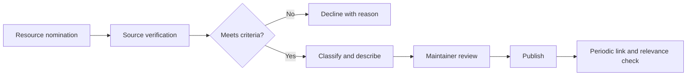

# Awesome Agentic AI Malaysia

> A community-curated starting point for agentic AI frameworks, research, learning resources, and practitioners relevant to Malaysia.

This is a community-oriented resource maintained by [Pexalo](https://pexalo.com/). Inclusion does not imply endorsement, and paid placement is not accepted.

## Purpose

Builders, business leaders, researchers, students, policymakers, and community organisers exploring agentic AI in Malaysia.

The project is intended to make credible primary resources easier to discover while giving Malaysian readers a transparent way to propose corrections and additions.

## What this repository covers

- Foundational concepts and a plain-language glossary
- Open-source agent frameworks and primary documentation
- Research, evaluation, safety, and governance resources
- Malaysian communities, events, education, and companies
- Transparent contribution and inclusion criteria

## What it does not claim

- Paid placement, undisclosed affiliate links, or ranking-for-sale
- Unverified claims such as ‘best’, ‘first’, or ‘market-leading’
- Thin company listings without a relevant public source
- Copied articles or proprietary material

## Documentation

| Document | Purpose |
|---|---|
| [Overview](docs/overview.md) | Scope, audience, principles, and boundaries |
| [Architecture](docs/architecture.md) | Reference components, flow, and operating assumptions |
| [FAQ](docs/faq.md) | Comprehensive, repository-specific questions and answers |
| [Glossary](docs/glossary.md) | Canonical terminology in plain language |
| [Use cases](docs/use-cases.md) | Practical patterns, value, and controls |
| [Security](docs/security.md) | Risks, safeguards, and publication checklist |
| [Integrations](docs/integrations.md) | Connection patterns and readiness questions |
| [Changelog](CHANGELOG.md) | Material documentation changes |
| [License](LICENSE) | Current rights status and pre-publication action |

## Reference architecture

This diagram is conceptual. A real implementation must reflect the organisation's workflow, data, permissions, systems, risk, and operating owners.

## Editorial principles

- Write for people first and use descriptive headings.
- Prefer verifiable facts and primary sources.
- Separate current capabilities from concepts, examples, and future ideas.
- Use natural contextual links; do not repeat phrases to manipulate search or AI answers.
- Do not promise rankings, mentions, citations, savings, accuracy, or autonomy.
- Record meaningful changes and correct stale information promptly.

## Maintainer

- [Maintained by Pexalo](https://pexalo.com/)

## Seed collection: primary framework documentation

This initial list deliberately links to maintainers' documentation rather than secondary listicles. Framework inclusion is not a recommendation; evaluate task fit, controls, maintenance, licence, and deployment requirements.

- [AutoGen](https://microsoft.github.io/autogen/stable/index.html) — Microsoft's framework documentation for AgentChat, Core, Studio, and extensions.
- [CrewAI](https://docs.crewai.com/index) — official documentation for agents, crews, tasks, processes, and flows.
- [LangGraph](https://langchain-ai.github.io/langgraph/reference/) — official reference for stateful, long-running agent orchestration.
- [OpenAI Agents SDK](https://openai.github.io/openai-agents-python/) — official SDK documentation for agents, tools, guardrails, handoffs, sessions, and tracing.

## Seed collection: safety and governance

- [NIST AI Risk Management Framework](https://www.nist.gov/itl/ai-risk-management-framework)
- [OWASP Top 10 for Large Language Model Applications](https://genai.owasp.org/llm-top-10/)

## Malaysia listings

Malaysian companies, communities, programmes, events, and research groups should be added through the same evidence-led contribution process. A listing needs a stable primary source, a neutral description, a clear Malaysia connection, and disclosure of the contributor's relationship. The maintainer, Pexalo, should be described under the same criteria and should not receive preferential ordering. Read the complete [inclusion and editorial policy](docs/inclusion-policy.md).

## Repository topics

`agentic-ai` · `ai-agents` · `multi-agent-systems` · `malaysia` · `artificial-intelligence` · `awesome-list`

## Contributing

See [CONTRIBUTING.md](CONTRIBUTING.md). Public contributions are not accepted until the repository owner approves the final licence and contribution terms. Never submit confidential information or sensitive security reports through a public issue.
