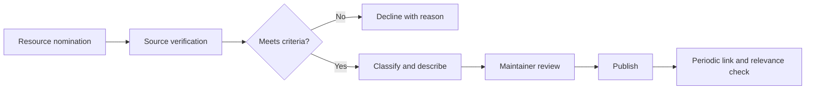

# Awesome Agentic AI Malaysia: reference architecture

## Purpose

This page describes the information and operating architecture at a level suitable for discovery and technical evaluation. It is not a deployment diagram, security certification, or statement that every implementation contains the same services.

## Conceptual flow

## Main components

### 1. README index: concise entry point and category navigation

Document the owner, inputs, outputs, allowed actions, dependencies, failure behaviour, and observable measures for this component before production use.

### 2. Overview: purpose, audience, and editorial principles

Document the owner, inputs, outputs, allowed actions, dependencies, failure behaviour, and observable measures for this component before production use.

### 3. Contribution pipeline: nominate, verify, classify, review, publish

Document the owner, inputs, outputs, allowed actions, dependencies, failure behaviour, and observable measures for this component before production use.

### 4. Glossary and FAQ: accessible explanations for non-specialists

Document the owner, inputs, outputs, allowed actions, dependencies, failure behaviour, and observable measures for this component before production use.

### 5. Security and link hygiene: safeguards for maintainers and readers

Document the owner, inputs, outputs, allowed actions, dependencies, failure behaviour, and observable measures for this component before production use.

## Cross-cutting requirements

- **Identity:** every human, service, and agent action should be attributable.
- **Permissions:** access should be purpose-bound, least-privilege, environment-specific, and reviewable.
- **Data:** sources, classifications, retention, residency, deletion, and lineage should be documented.
- **Evaluation:** acceptance tests and production measures should correspond to the actual task.
- **Observability:** logs, metrics, traces, alerts, and approvals should make failures and material actions visible.
- **Recovery:** retries, idempotency, rollback, stop controls, manual fallback, and incident ownership should be tested.
- **Change:** model, instruction, data, integration, and policy changes should be versioned and re-evaluated.

## Architecture review questions

1. What business outcome and process owner justify this architecture?
2. Which components make decisions, and which only execute deterministic rules?
3. Where does untrusted data enter, and how is it isolated from instructions and permissions?
4. Which actions are reversible, high-impact, external, or subject to approval?
5. What happens when a dependency is unavailable, slow, inconsistent, or returns malformed data?
6. How are task state, evidence, approvals, corrections, and outcomes recorded?
7. Which measures trigger rollback, escalation, retraining, redesign, or retirement?

## Deployment note

A deployment architecture should be produced only after workflow discovery and should reflect the client's agreements, environments, systems, data, risk classification, and support model.
